# Лабораторная работа. Базовая настройка коммутатора

##	Топология
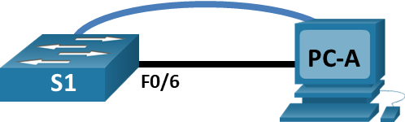
 
## Таблица адресации

|Устройство|Интерфейс|IP-адрес / префикс|
|:---------------------:|:----------------------:|:-------------------:|
|S1|VLAN 1|192.168.1.2 /24|
|PC-A|NIC|192.168.1.10 /24|

## Необходимые ресурсы
•	1 коммутатор (Cisco 2960 с ПО Cisco IOS версии 15.2(2) с образом lanbasek9 или аналогичная модель)
•	1 ПК (под управлением Windows с программой эмуляции терминала, например, Tera Term)
•	1 консольный кабель для настройки устройства на базе Cisco IOS через консольный порт.
•	1 кабель Ethernet, как показано в топологии.

### Часть 1. Создание сети и проверка настроек коммутатора по умолчанию

#### Шаг 1. Создание сети согласно топологии.
a.	Подсоединен консольный кабель, как показано в топологии. На данном этапе не подключен кабель Ethernet компьютера PC-A.
b.	Установлено консольное подключение к коммутатору с компьютера PC-A с помощью программы эмуляции терминала.
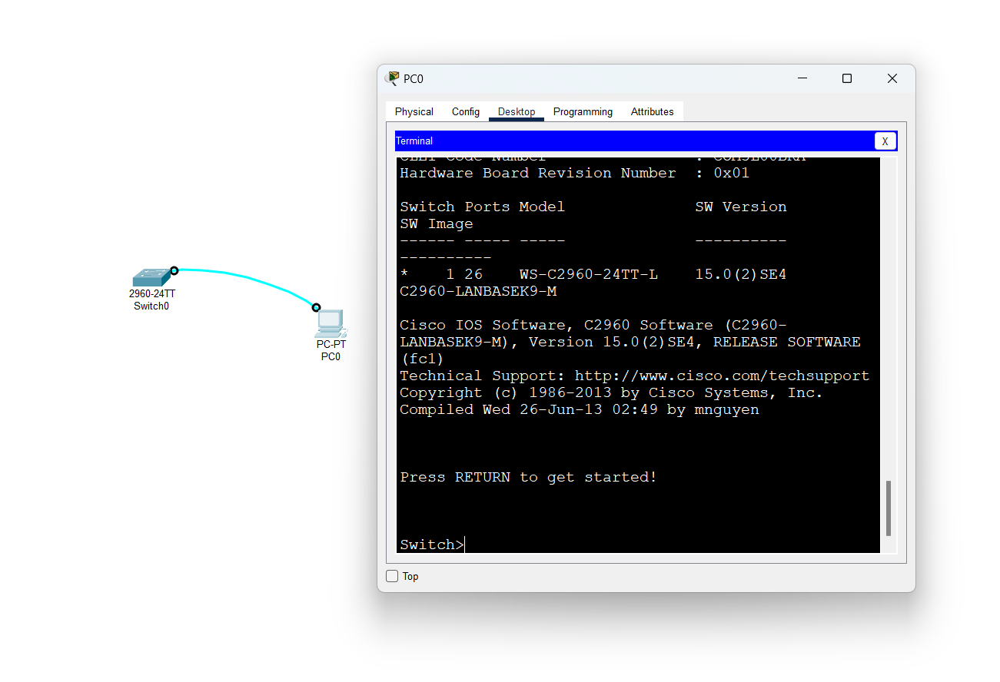
###### Вопрос:
    Почему нужно использовать консольное подключение для первоначальной настройки коммутатора? Почему нельзя подключиться к коммутатору через Telnet или SSH? - **не настроен адрес устройства, требуется прямое подклчюение через кабель**

#### Шаг 2. Проверка настройки коммутатора по умолчанию.
a.	Проверка настройки комутатора в привилигированном режиме
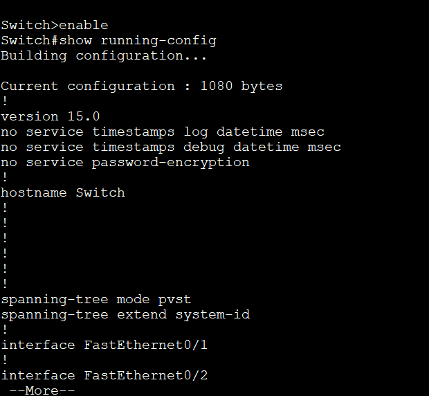

b.	Изучение текущего файла running configuration.
выполняю команду Switch# show running-config
Вопросы:
Сколько интерфейсов FastEthernet имеется на коммутаторе 2960? - **24**
Сколько интерфейсов Gigabit Ethernet имеется на коммутаторе 2960? - **2**
Каков диапазон значений, отображаемых в vty-линиях? - **0-4 и 5-15**

c.	Изучение файла загрузочной конфигурации (startup configuration), который содержится в энергонезависимом ОЗУ (NVRAM).
выполняю команду Switch# show startup-config
*Появляется сообщение startup config is not present*
Вопрос:
Почему появляется это сообщение? - **так как не был установлен startup-config**

d.	Изучение характеристик SVI для VLAN 1.
выполняю команду Switch# show interface vlan1
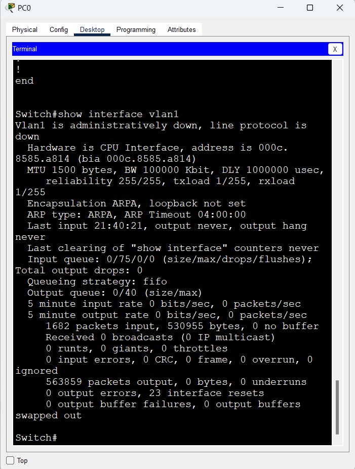
Вопросы:
Назначен ли IP-адрес сети VLAN 1? - **нет**
Какой MAC-адрес имеет SVI? Возможны различные варианты ответов. - **000c.8585.a814**
Данный интерфейс включен? - **нет**

e.	Изучение IP-свойств интерфейса SVI сети VLAN 1.
выполняю команду Switch# show ip interface vlan1
Вопрос:
Какие выходные данные вы видите? - **Vlan1 is administratively down, line protocol is down Internet protocol processing disabled**

f.	Подсоединение кабеля Ethernet компьютера PC-A к порту 6 на коммутаторе и изучите IP-свойства интерфейса SVI сети VLAN 1.

Вопрос:
Какие выходные данные вы видите? - **Line protocol on Interface FastEthernet0/6, changed state to up**

g.	Изучение сведений о версии ОС Cisco IOS на коммутаторе.
выполняю команду Switch# show version
Вопросы:
Под управлением какой версии ОС Cisco IOS работает коммутатор? - **Version 15.0(2)SE4**
Как называется файл образа системы? - **System image file is "flash:c2960-lanbasek9-mz.150-2.SE4.bin"**

h.	Изучите свойства по умолчанию интерфейса FastEthernet, который используется компьютером PC-A.
выполняю команду Switch# show interface f0/6 
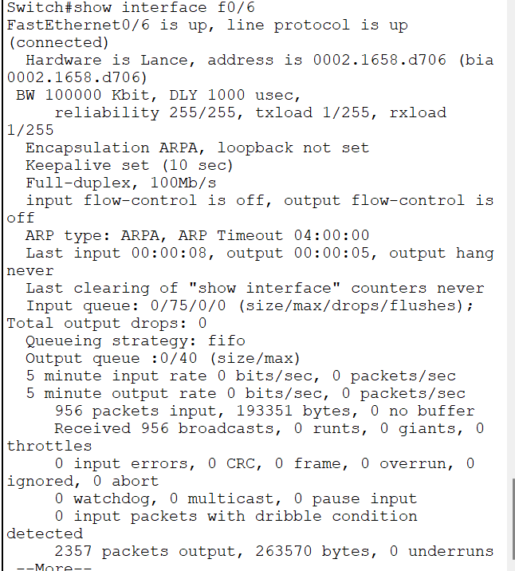
Вопрос:
Интерфейс включен или выключен? - **FastEthernet0/6 is up, line protocol is up (connected)**
Что нужно сделать, чтобы включить интерфейс? - **подсоединить кабель**
Какой MAC-адрес у интерфейса? - **0002.1658.d706**
Какие настройки скорости и дуплекса заданы в интерфейсе?- **Full-duplex, 100Mb/s**

i.	Изучение флеш-памяи.
выполняю команды
Switch# show flash 
Switch# dir flash: 
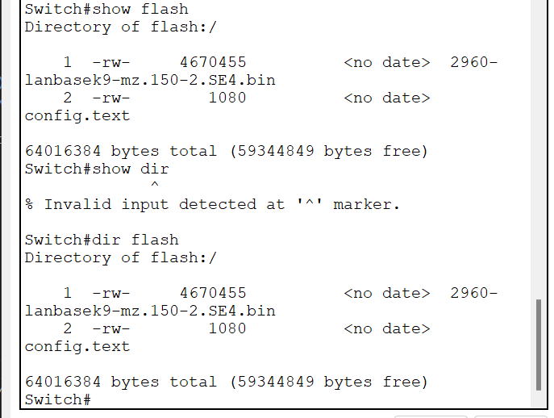
Вопрос:
Какое имя присвоено образу Cisco IOS? - **2960-lanbasek9-mz.150-2.SE4.bin**

### Часть 2. Настройка базовых параметров сетевых устройств
#### Шаг 1. Настройте базовые параметры коммутатора.
a.	В режиме глобальной конфигурации применяю следующие базовые параметры конфигурации и вставьте их в файл на коммутаторе S1. 
no ip domain-lookup
hostname S1
service password-encryption
enable secret class
banner motd #
Unauthorized access is strictly prohibited. #

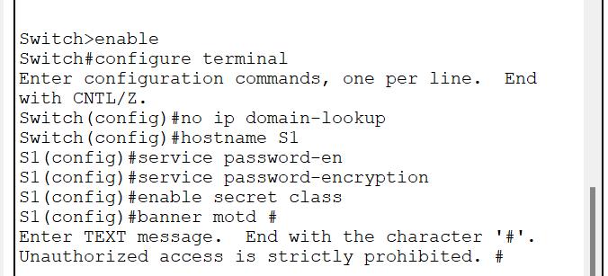

b.	Назначаю IP-адрес интерфейсу SVI на коммутаторе. Благодаря этому получаю возможность удаленного управления коммутатором.
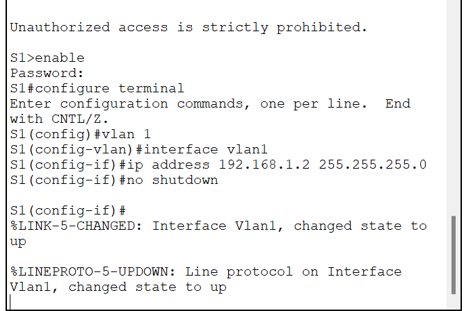

c.	Доступ через порт консоли также следует ограничить  с помощью пароля. Использую cisco в качестве пароля для входа в консоль в этом задании. Конфигурация по умолчанию разрешает все консольные подключения без пароля. Чтобы консольные сообщения не прерывали выполнение команд, использую параметр logging synchronous.
S1(config)# line con 0
S1(config-line)# logging synchronous 
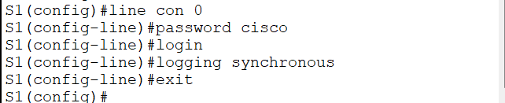

d.	Настраиваю каналы виртуального соединения для удаленного управления (vty), чтобы коммутатор разрешил доступ через Telnet. Если не настроить пароль VTY, будет невозможно подключиться к коммутатору по протоколу Telnet.
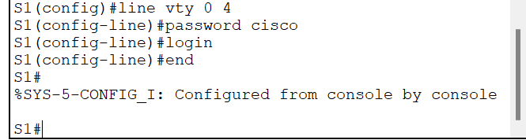
Вопрос:
Для чего нужна команда login? - **функция команды login состоит в аутентификации пользователя и предоставлении доступа к различным функциям и ресурсам устройства**

#### Шаг 2. Настройте IP-адрес на компьютере PC-A.
Назначаю компьютеру IP-адрес и маску подсети в соответствии с таблицей адресации.
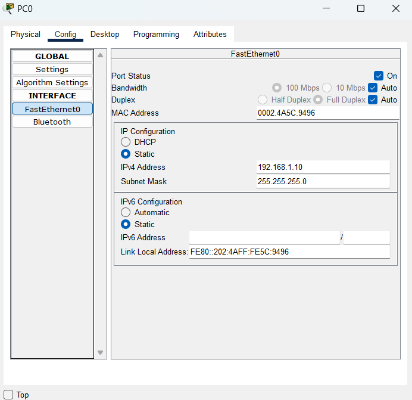

