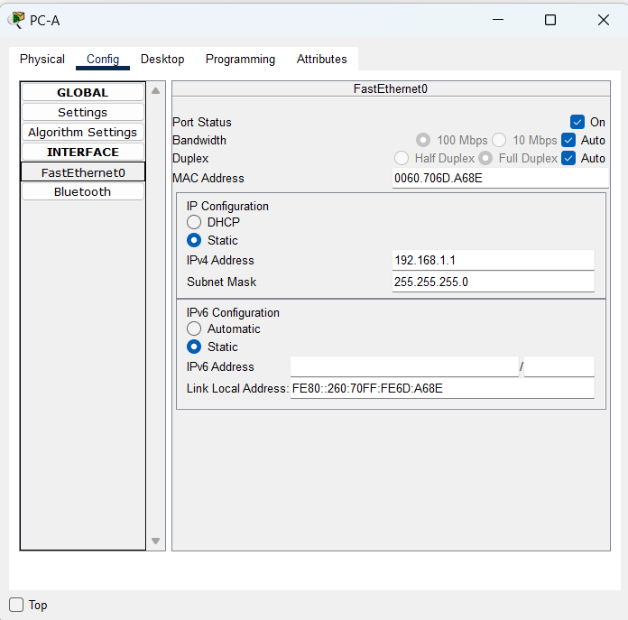
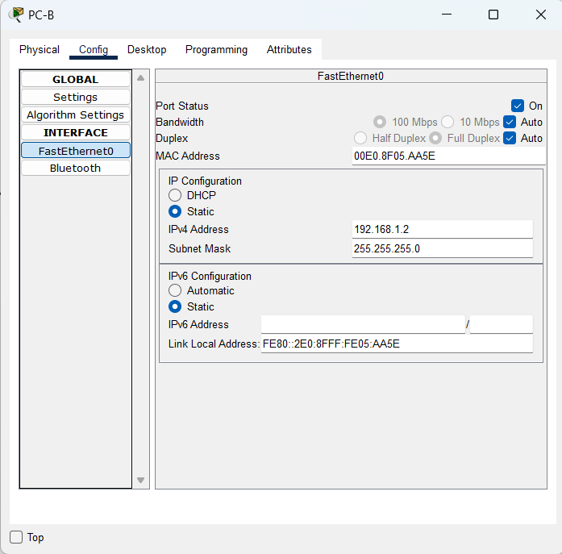
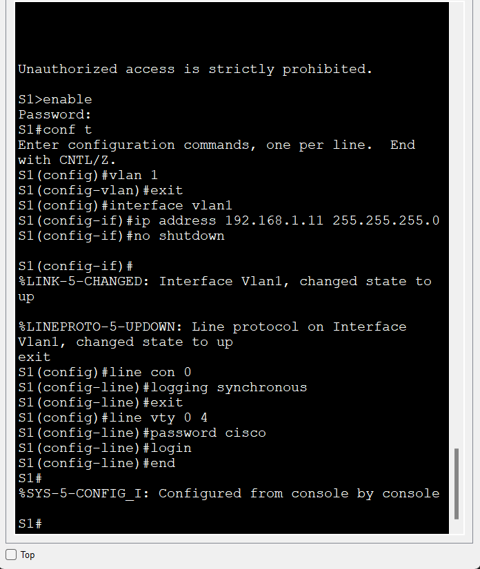

# Лабораторная работа. Просмотр таблицы MAC-адресов коммутатора

##	Топология

 
## Таблица адресации

|Устройство|Интерфейс|IP-адрес|Маска подсети|
|:----------------:|:---------------:|:---------------:|:---------------:|
|S1|VLAN 1|192.168.1.11|255.255.255.0|
|S2|VLAN 1|192.168.1.12|255.255.255.0|
|PC-A|NIC|192.168.1.1|255.255.255.0|
|PC-B|NIC|192.168.1.2|255.255.255.0|

##	Необходимые ресурсы

* 2 коммутатора (Cisco 2960 с операционной системой Cisco IOS 15.2(2) (образ lanbasek9) или аналогичная модель)
* 2 ПК (Windows и программа эмуляции терминала, такая как Tera Term)
* Консольные кабели для настройки устройств Cisco IOS через консольные порты
* Кабели Ethernet, расположенные в соответствии с топологией

### Часть 1. Создание сети и проверка настроек коммутатора по умолчанию

#### Шаг 1. Подключаю сеть в соответствии с топологией

#### Шаг 2. Настраиваю узлы ПК

#### Шаг 3. Выполняю инициализацию и перезагрузку двух коммутаторов

#### Шаг 4. Настраиваю базовые параметры каждого коммутатора

a.	Настраиваю имена устройств в соответствии с топологией
b.	Настраиваю IP-адреса, как указано в таблице адресации
c.	Назначаю cisco в качестве паролей консоли и VTY
d.	Назначаю class в качестве пароля доступа к привилегированному режиму EXEC

*Настройка коммутатора S1*

*Настройка коммутатора S2*

Далее делаю команду `copy running-config startup-config` на каждом коммутаторе

### Часть 2. Изучение таблицы МАС-адресов коммутатора

#### Шаг 1. Запишите МАС-адреса сетевых устройств.

a.	Открываю командную строку на PC-A и PC-B и ввожу команду ipconfig /all.
Открываю окна командной строки Windows
Вопрос
MAC-адрес компьютера PC-A:
MAC-адрес компьютера PC-B:
Закрываю окно командной строки.
b.	Подключаюсь к коммутаторам S1 и S2 через консоль и ввожу команду show interface F0/1 на каждом коммутаторе.
Открываю окно конфигурации
Вопрос
Назовите адреса оборудования во второй строке выходных данных команды (или зашитый адрес — bia).
МАС-адрес коммутатора S1 Fast Ethernet 0/1:
МАС-адрес коммутатора S2 Fast Ethernet 0/1:
Закройте окно настройки.

#### Шаг 2. Просмотрите таблицу МАС-адресов коммутатора.
Подклююсь к коммутатору S2 через консоль и просматриваю таблицу МАС-адресов до и после тестирования сетевой связи с помощью эхо-запросов.
a.	Подключитесь к коммутатору S2 через консоль и войдите в привилегированный режим EXEC
Открываю окно конфигурации
b.	В привилегированном режиме EXEC ввожу команду show mac address-table и нажмите клавишу ввода.
S2# show mac address-table
Вопросы:
Записаны ли в таблице МАС-адресов какие-либо МАС-адреса?
Какие МАС-адреса записаны в таблице? С какими портами коммутатора они сопоставлены и каким устройствам принадлежат? Игнорируйте МАС-адреса, сопоставленные с центральным процессором.
Если вы не записали МАС-адреса сетевых устройств в шаге 1, как можно определить, каким устройствам принадлежат МАС-адреса, используя только выходные данные команды show mac address-table? Работает ли это решение в любой ситуации?

#### Шаг 3. Очистите таблицу МАС-адресов коммутатора S2 и снова отобразите таблицу МАС-адресов.

a.	В привилегированном режиме EXEC ввожу команду clear mac address-table dynamic и нажмите клавишу Enter.
S2# clear mac address-table dynamic

b.	Снова быстро ввожу команду show mac address-table.
Вопросы:
Указаны ли в таблице МАС-адресов адреса для VLAN 1? Указаны ли другие МАС-адреса?
Через 10 секунд введите команду show mac address-table и нажмите клавишу ввода. Появились ли в таблице МАС-адресов новые адреса?

#### Шаг 4. С компьютера PC-B отправьте эхо-запросы устройствам в сети и просмотрите таблицу МАС-адресов коммутатора.

a.	На компьютере PC-B открываю командную строку и еще раз введите команду arp -a.
Открываю командную строку.
Вопрос:
Не считая адресов многоадресной и широковещательной рассылки, сколько пар IP- и МАС-адресов устройств было получено через протокол ARP?

b.	Из командной строки PC-B отправляю эхо-запросы на компьютер PC-A, а также коммутаторы S1 и S2.
Вопрос:
От всех ли устройств получены ответы? Если нет, проверьте кабели и IP-конфигурации.
Закрываю командную строку.

c.	Подключившись через консоль к коммутатору S2, ввожу команду show mac address-table.
Открываю окно конфигурации
Вопрос:
Добавил ли коммутатор в таблицу МАС-адресов дополнительные МАС-адреса? Если да, то какие адреса и устройства?
На компьютере PC-B открываю командную строку и еще раз ввожу команду arp -a.
Вопрос:
Появились ли в ARP-кэше компьютера PC-B дополнительные записи для всех сетевых устройств, которым были отправлены эхо-запросы?
Закрываю командную строку.

#### Вопрос для повторения
В сетях Ethernet данные передаются на устройства по соответствующим МАС-адресам. Для этого коммутаторы и компьютеры динамически создают ARP-кэш и таблицы МАС-адресов. Если компьютеров в сети немного, эта процедура выглядит достаточно простой. Какие сложности могут возникнуть в крупных сетях?
